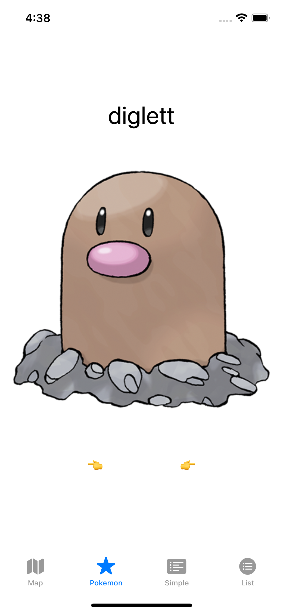
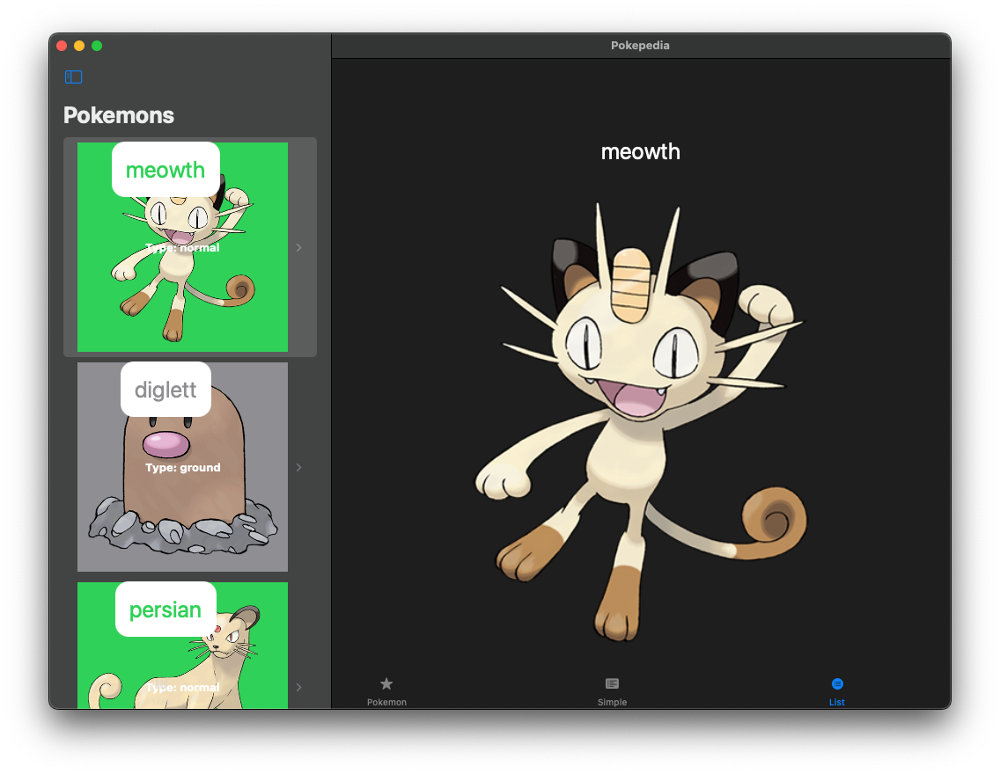
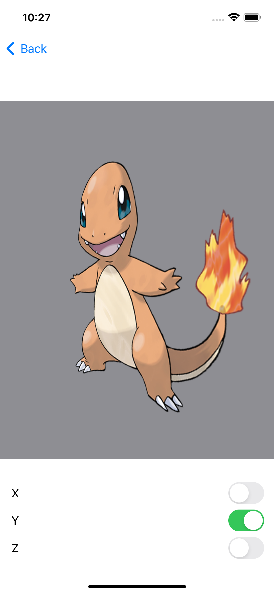

# iOS desde cero


## 쯈ué es esto?

[iOS desde Cero](https://www.twitch.tv/dfreniche) es un Streaming en 🇪🇸 sobre desarrollo iOS, que puedes seguir en directo en [Twitch](https://www.twitch.tv/dfreniche). O en diferido en mi [canal de Youtube](https://www.youtube.com/user/dfreniche). 

Es un stream, así que no esperes un curso, o un video perfectamente elaborado. Cometeré errores, me verás teclear el código, depurar programas y mirar la documentación. StackOverflow hará más de una aparición estelar. Es real como la vida misma.

Te espero en:
- 💻 [Twitch](https://www.twitch.tv/dfreniche)
- 📺 [Youtube](https://www.youtube.com/playlist?list=PL_HBkKAYQ7La9ToFMO3_I9LrTMwm8Rnxo)

## 쮺uándo lo perpetras?

Los episodios se emiten Lunes y Jueves en horario:

|          | Martes y Jueves |
| :--------| :---------- | 
| 12:00    | 🇲🇽 Ciudad de México  | 
| 12:00    | 🇺🇸 Dallas  |  
| 12:00    | 🇺🇸 Nueva York  | 
| 12:00    | 🇨🇷 San José  |  
| 13:00    | 🇨🇴 Bogotá  | 
| 13:00    | 🇵🇦 Ciudad de Panamá  |  
| 13:00    | 🇨🇺 La Habana  |  
| 13:00    | 🇵🇪 Lima  |  
| 13:00    | 🇪🇨 Quito  |  
| 14:00    | 🇻🇪 Caracas  |  
| 14:00    | 🇧🇴 La Paz  |  
| 15:00    | 🇵🇾 Asunción  |  
| 15:00    | 🇦🇷 Buenos Aires  |
| 15:00    | 🇺🇾 Montevideo  |  
| 15:00    | 🇨🇱 Santiago de Chile  |  
| 19:00    | 🇪🇸 Madrid   |  

Si echas de menos la capital de tu país, abre un [issue](https://github.com/dfreniche/ios-desde-cero/issues)

Si cancelo algún episodio lo anunciaré por [Twitter](https://twitter.com/dfreniche) y puedes consultar la planificación en [Twitch](https://www.twitch.tv/dfreniche/schedule)

## Requisitos para seguir el Streaming

- un ordenador y conexión a Internet 😜
- para escribir Apps iOS se necesita __un ordenador que corra macOS__. Big Sur o Monterrey son necesarios.
- __Xcode 13 o 14 (Beta)__
- __Conocimientos básicos de programación__. No es imprescindible conocer Swift, aunque ayuda.
- __Ganas de programar y pasar un buen rato__. Esto no es el trabajo o los estudios. Es para pasarlo bien y compartir.

## Pero, 쯗e qué vas a hablar?

Aunque tengo una idea muy general de [lo que voy a ir viendo en los distintos episodios](Episodios.md), se verá lo que la comunidad quiera. 

Es decir, que si algo no se entiende, se volverá a ver. Si hay interés en ver algo concreto, igual. Siempre recordando que esto es un canal para gente empezando con iOS y no es consultoría gratis. Esa la cobro aparte. Y caro. 💸

## 쯏 si me pierdo el Streaming?

Al día siguiente publicaré en esta [lista de reproducción de Youtube](https://www.youtube.com/embed/videoseries?list=PL_HBkKAYQ7La9ToFMO3_I9LrTMwm8Rnxo) el episodio correspondiente:

[](https://www.youtube.com/embed/videoseries?list=PL_HBkKAYQ7La9ToFMO3_I9LrTMwm8Rnxo)

## Episodios

En la carpeta [Episodios](./episodios/) tienes el código usado en cada stream, junto con una pequeña descripción de lo que hemos visto y un enlace al vídeo correspondiente.

## 쮺칩mo uso el código de cada episodio?

Si tienes instalado Xcode, tienes instalado `git`. Git es un sistema de control de versiones muy utilizado y el que usa Github. Para bajarte una copia completa de este repositorio lo más sencillo es que abras una terminal, te vayas a la carpeta que prefieras (con `cd Desktop` irías al Escritorio, por ej.) y escribas:

```bash
git clone https://github.com/dfreniche/ios-desde-cero
```

Esto crea una carpeta llamada `ios-desde-cero`. Si la exploras verás que en la carpeta Episodios está cada episodio, con el código como quedó al finalizar ese episodio. Haz doble click en el proyecto de Xcode y se abrirá.

Una vez lo tengas bajado, para actualizarlo haz:

```bash
git pull origin
```

## Ejemplos desarrollados

|   App     |  iOS    |  macOS  |
| :------------- | :----------: | :----------: | 
|  [Adivina El Número](/episodios/ep_002/AboutMe/): App iOS con un About Me y un pequeño juego de adivina el número correcto |    | |
|  [Pokepedia](/episodios/ep_015/Pokepedia/): App iOS/macOS que usando http://pokeapi.com muestra Pokemons en listas, mapas, de uno en uno, etc. |   |  | 
|  [Animations](/episodios/ep_019/Animations/): App iOS/macOS con distintos ejemplos de animaciones. | [](img/animations-video.mp4) |   |
|  [Pixelator](/episodios/ep_033/Pixelator/): App iOS/macOS para dibujar Pixel Art |  |   |


## Recursos

- [The Swift Programming Language en Español](https://swift-book-es.vercel.app). Tradución de [Mauricio Paternina](https://twitter.com/spaceinvadev)
- https://github.com/Toni77777/awesome-swiftui-libraries
- [Xcode Releases](https://xcodereleases.com/)
- [Ejercicios resueltos de Swift](https://fernandoruizrico.com/swift-ejercicios-resueltos-i/)